# Vercel Website Proxy

## Quick start

Chinese Notice: 如果无法查看此文档中的图片,请下载次项目后在自己电脑查看此 README.md

1、Fork this repository  

2、rewrite target host name in api/proxy.js (default google.com)

```js
const { createProxyMiddleware } = require("http-proxy-middleware");

module.exports = (req, res) => {
  let target = "https://www.google.com/";//your website url
  //   if (
  //     req.url.startsWith("/api") ||
  //     req.url.startsWith("/auth") ||
  //     req.url.startsWith("/banner") ||
  //     req.url.startsWith("/CollegeTask")
  //   ) {
  //     target = "http://106.15.2.32:6969";
  //   }

  createProxyMiddleware({
    target,
    changeOrigin: true,
    pathRewrite: {
      // rewrite request path `/backend`
      //  /backend/user/login => http://google.com/user/login
      //   "^/backend/": "/",
    },
  })(req, res);
};

```


3、Registering your vercel account [vercel](https://vercel.com/)  
4、Binding your github account in vercel's settings.

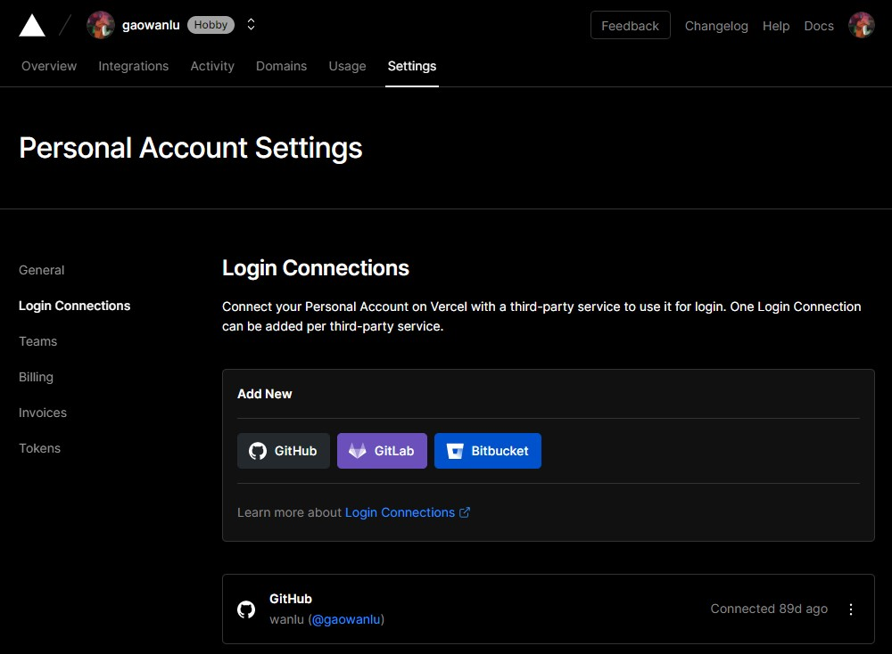

5、To config your vercel Rep.

Import Git repository,steps: Overview=>Add New...=>Project.

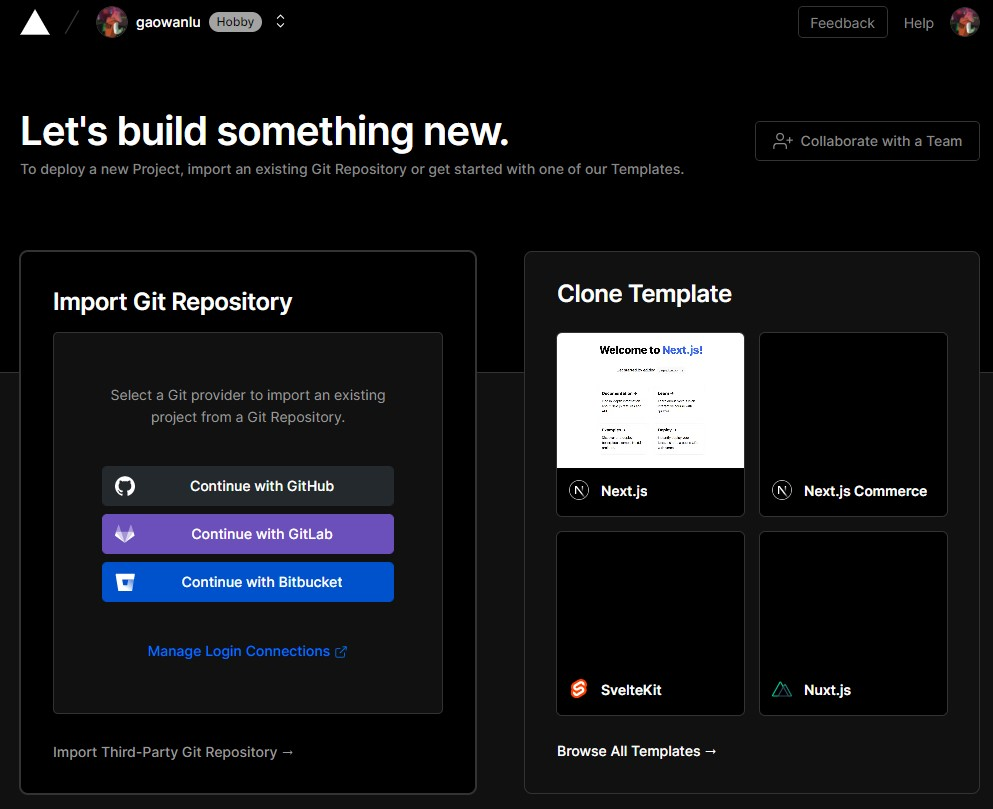

Click Button "Continue with Github".

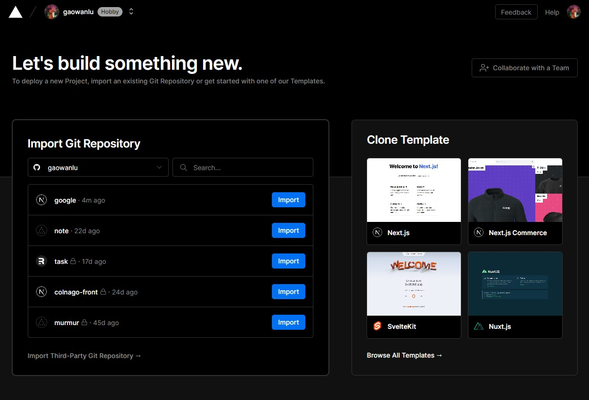

To import your repository forked,such as google etc.

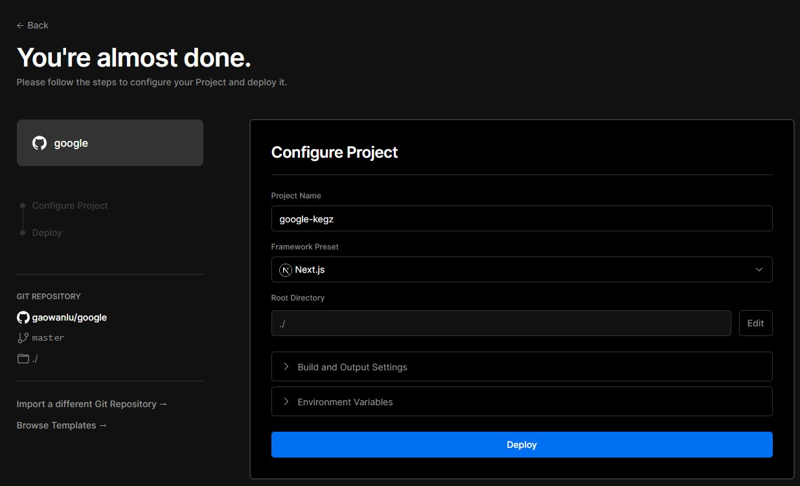

Waiting for deploy process

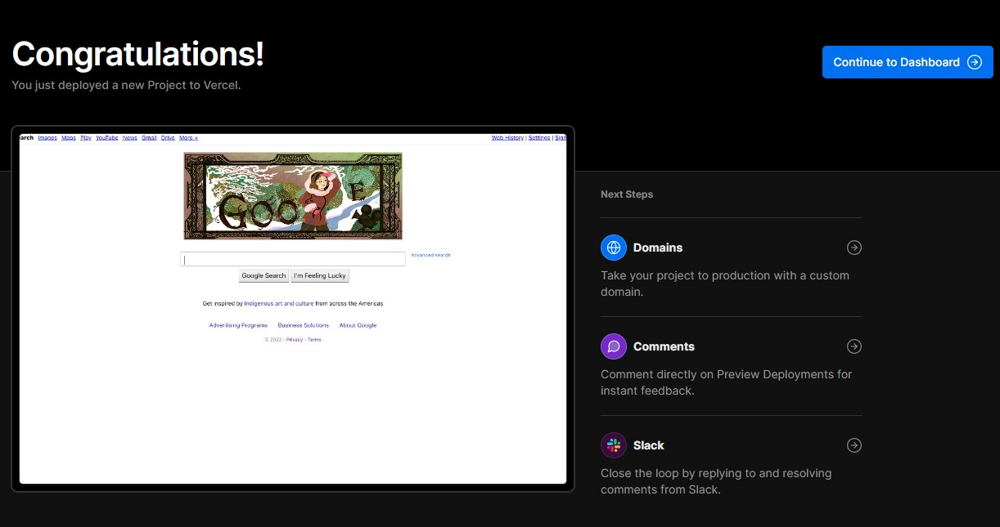

The domain vercel for you

In 2022, the vercel domain name in mainland China will be polluted by DNS, so you should register a domain name in mainland China. Usually, novices on major domain name platforms can get a domain name with one-year usage rights for 1 yuan.

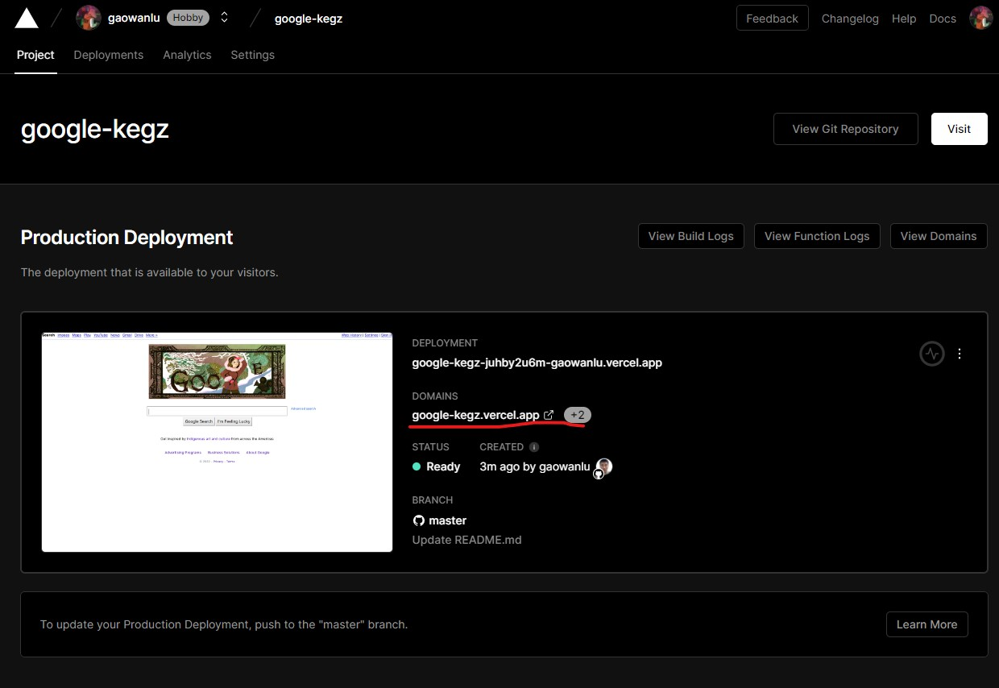

6、Register your own domain name and perform real-name registration according to the real-name registration rules of the domain name manager

No more elaboration, if you encounter problems, you can submit an issue, and some netizens will answer your questions with each other.

7、To config your own domain and cname

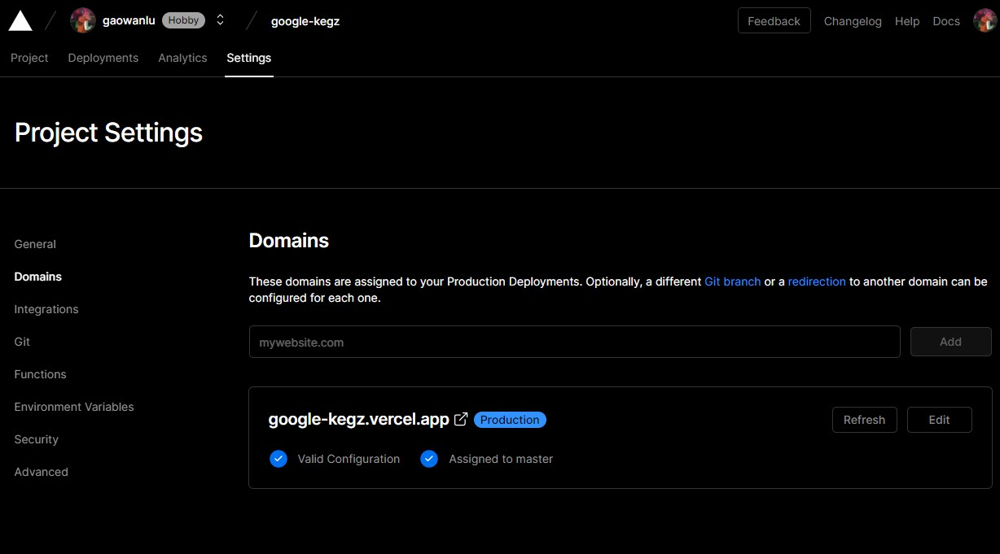
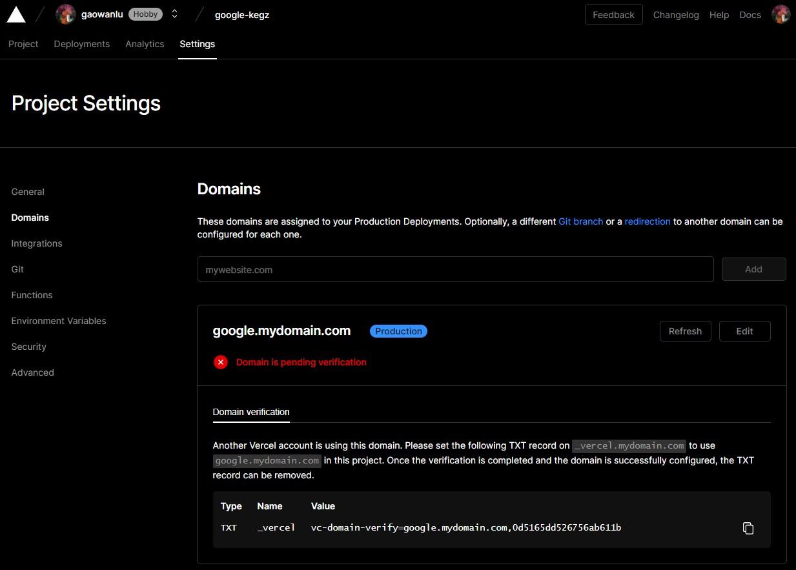

Manage your domain name

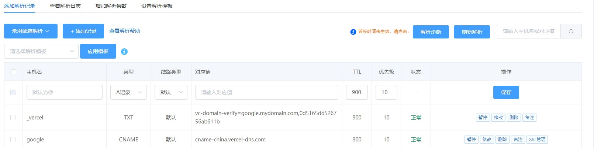

The TXT record needs to fill in the content provided by vercel above, and the cname is the same

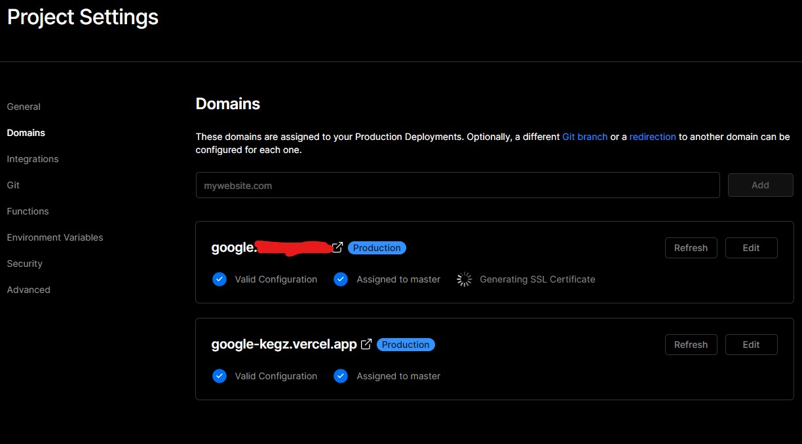

8、Enjoy it

`https://google.{{mydomain}}.com`

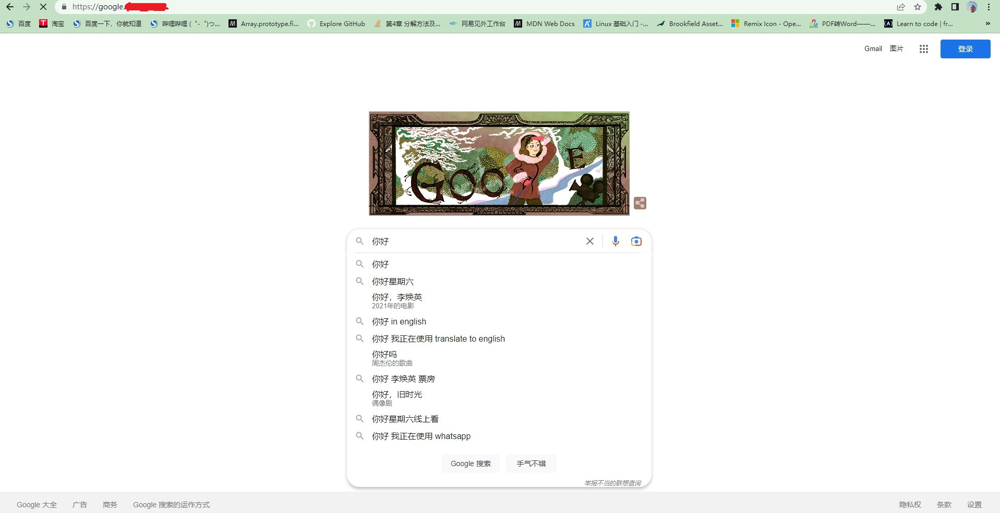

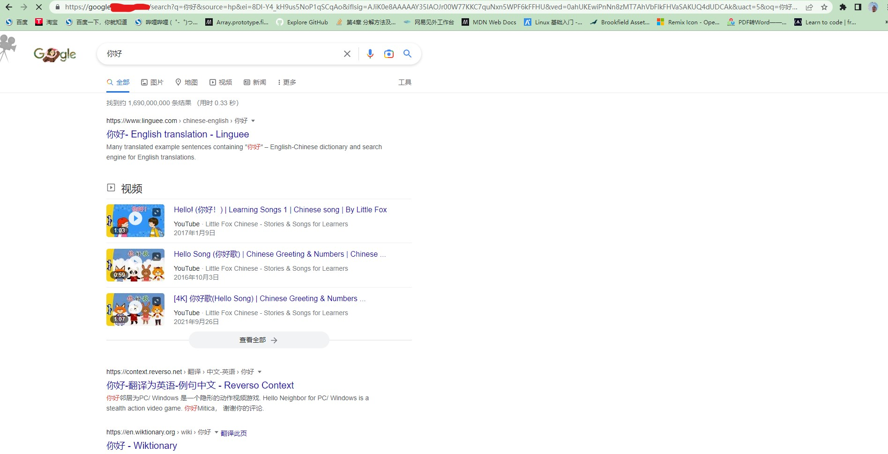

9、Modify the default browser engine for your own service

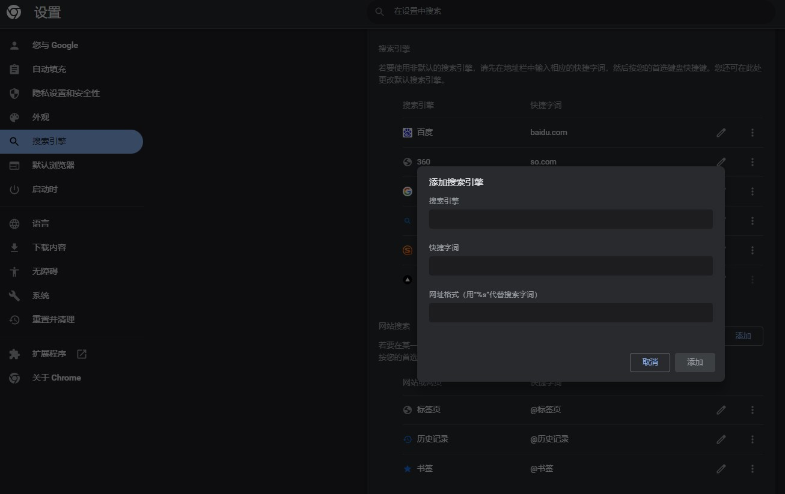

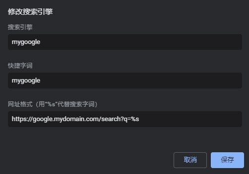

Setting the default item

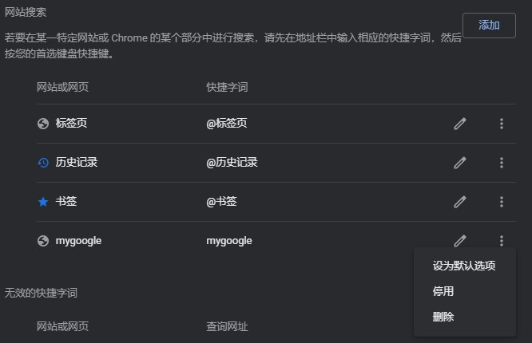

## Change which data center your service is in

This affects your ip address when you use google search

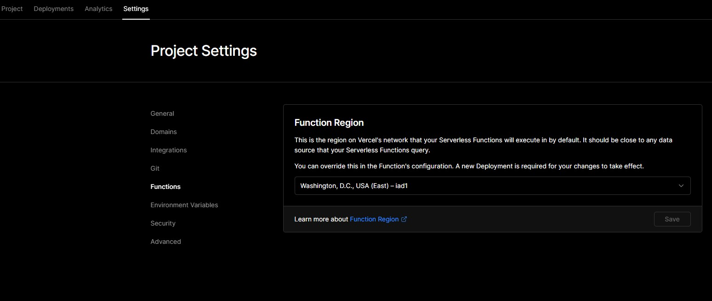
